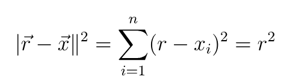
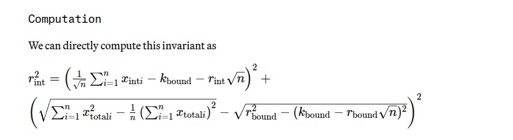
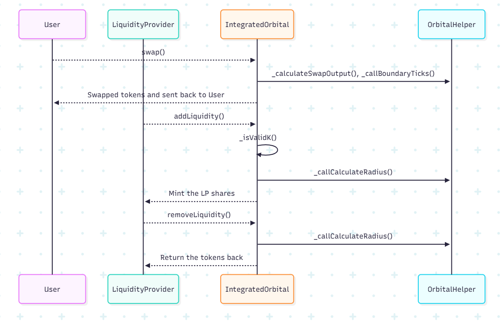

## Introduction

> **Orbital Pool isn’t just another AMM, it’s a paradigm shift. The future holds a million stablecoins. Today's infrastructure isn't ready.**

Orbital is an automated market maker for pools of 2, 3, or 10,000 stablecoins. It unlocks capital efficiency by bringing concentrated liquidity to higher dimensions.

By bending liquidity into a torus-shaped universe, Orbital unlocks concentrated liquidity for three or more stablecoins at once. This isn’t your usual 2D liquidity grid—it’s an entirely new dimension where LPs can laser-focus around the $1 mark, while still guaranteeing fair prices even if an entire stablecoin depegs.

It’s like Uniswap V3’s surgical precision colliding head-on with Curve’s bulletproof stability, and the result is something that shouldn’t even exist, but somehow, it does.

Orbital is the AMM where capital efficiency doesn’t just scale, it warps!

## Mathematical Visualization
<p float="left"> 
</p>

## Key Features

- **Multi-Token Stability Engine**: Seamlessly trade across three or more stablecoins in a single pool with no more fragmented liquidity.
- **Warped Concentrated Liquidity**: Liquidity providers can laser-focus capital around $1, achieving maximum efficiency while still keeping markets resilient.
- **Torus Invariant Model**: A breakthrough mathematical invariant that curves liquidity across dimensions, ensuring fair pricing even in extreme scenarios.
- **Boundary-Aware Swaps**: Swaps automatically handle transitions between interior and boundary regions, ensuring correct pricing even at the edge of the liquidity surface.
- **Fusion of Giants (Uniswap × Curve)**: Orbital takes Uniswap V3’s precision and Curve’s stability, merging them into a next-generation AMM.
- **Powered by Arbitrum Stylus + Rust**: Our entire mathematical engine runs in Rust via Stylus, unlocking performance and gas efficiency for complex calculations.

## Mathematical Foundation

### The Orbital Model

The Orbital AMM is built on the mathematical foundation described in the [Paradigm Orbital Whitepaper](https://www.paradigm.xyz/2025/06/orbital). The core innovation lies in extending concentrated liquidity to higher dimensions using spherical geometry.

#### Core Mathematical Concepts

**1. Sphere AMM Formula**

 

Where:
- `r(vector) = (r, r, ..., r)` vector is the center of the sphere
- `xᵢ` is the AMM's reserve of asset i
- `r` is the radius of the sphere

**2. Torus Invariant**

The pool uses a torus (donut-shaped) invariant that combines:
- **Interior Ticks**: Behave like spheres for normal trading
- **Boundary Ticks**: Behave like circles when reserves hit boundaries



**3. Newton's Method**

Implementation of newton's method in Stylus contract to solve torus invariant with multiple fallback strategy.

**4. Q96X48 Implementation** 
We utilize the Q96X48 fixed-point arithmetic format, where the lower 48 bits represent the fractional component and the upper 96 bits represent the integer component.

**5. Tick Geometry**

Each tick is defined by:
- **k**: Plane constant (tick identifier)
- **r**: Radius of the tick
- **Status**: Interior or Boundary

## Architecture & User Flow

 

 

## 🚀 Quick Start

### Prerequisites

- Foundry installed
- Node.js 16+ (for testing)
- Git

### Installation

```bash
# Clone the repository
git clone https://github.com/agrawalx/orbital-pool-organized.git
cd orbital-pool-organized/solidity

# Install dependencies
forge install

# Build the project
forge build

# Run tests
forge test
```

### Steps to configure your own pool

```bash
# Deploy pool and the mock tokens
forge script script/DeployAndConfig.s.sol --rpc-url $RPC_URL --private-key $PRIVATE_KEY --broadcast

# Command to add liqudity
cast send $POOL_ADDRESS "addLiquidity(uint256,uint256[5])" 3000000000000000 "[1000000000000000000000,1000000000000000000000,1000000000000000000000,1000000000000000000000,1000000000000000000000]" --rpc-url $RPC_URL --private-key $PRIVATE_KEY

# Command to swap 
cast send $POOL_ADDRESS "swap(uint256,uint256,uint256,uint256)" 0 1 20000000000000000000 0 --rpc-url $RPC_URL --private-key $PRIVATE_KEY
```

## Youtube Link

- [Video Demo](https://www.youtube.com/watch?v=b1orvJa6OE8)

## Documentation

### Whitepaper Reference

This implementation is based on the [Paradigm Orbital Whitepaper](https://www.paradigm.xyz/2025/06/orbital), which provides the mathematical foundation for the Orbital AMM model.

### Key Concepts from Whitepaper

1. **Sphere AMM**: Base mathematical model using spherical geometry
2. **Torus Invariant**: Combined interior and boundary tick behavior
3. **Tick Consolidation**: Efficient aggregation of similar ticks
4. **Global Trade Invariant**: Method for calculating large trades across multiple ticks

## 📄 License

This project is licensed under the MIT License.

*Built with ❤️ by the Orbital*